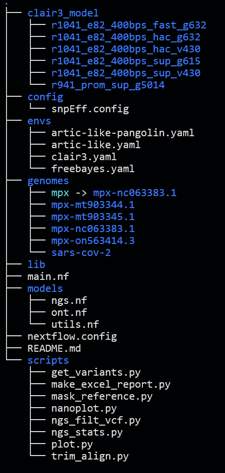
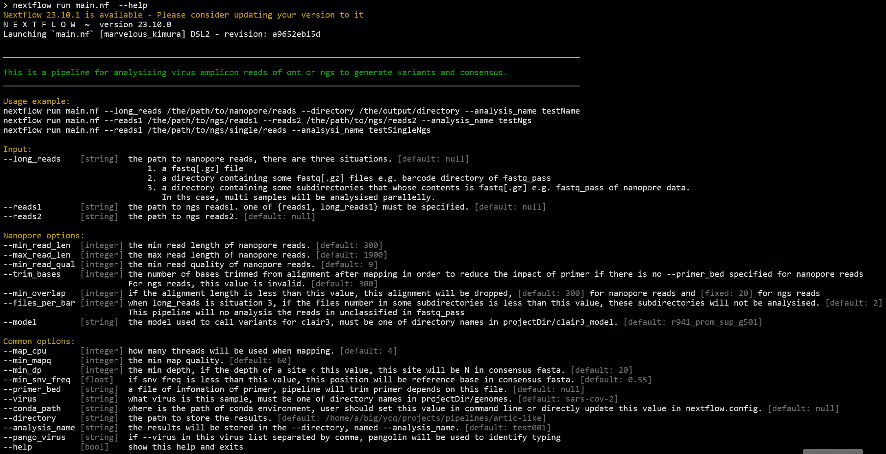
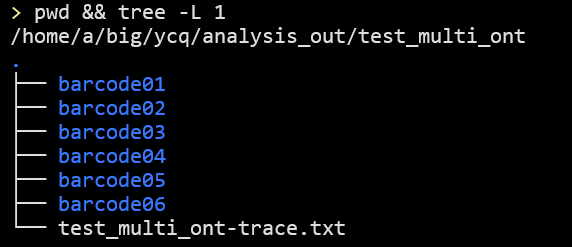
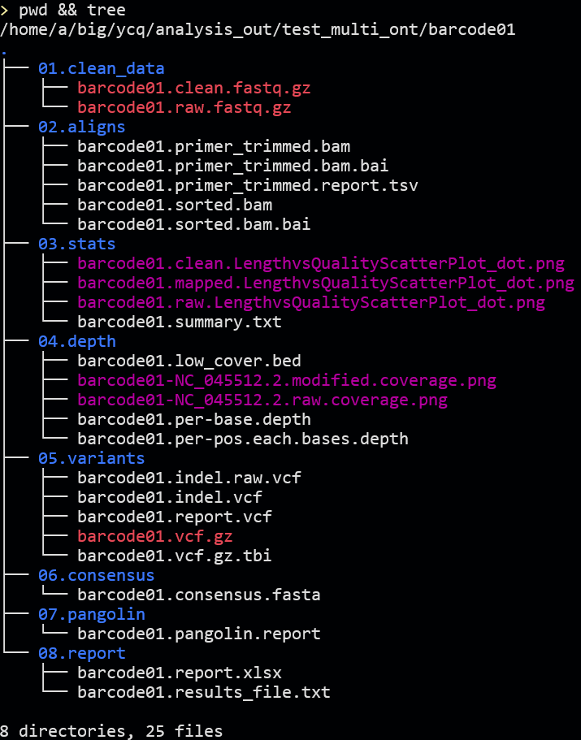
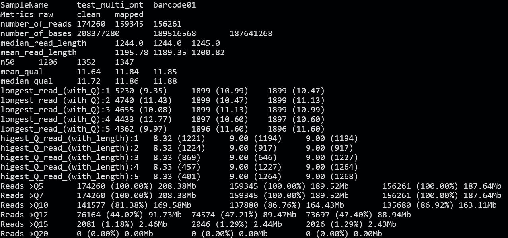
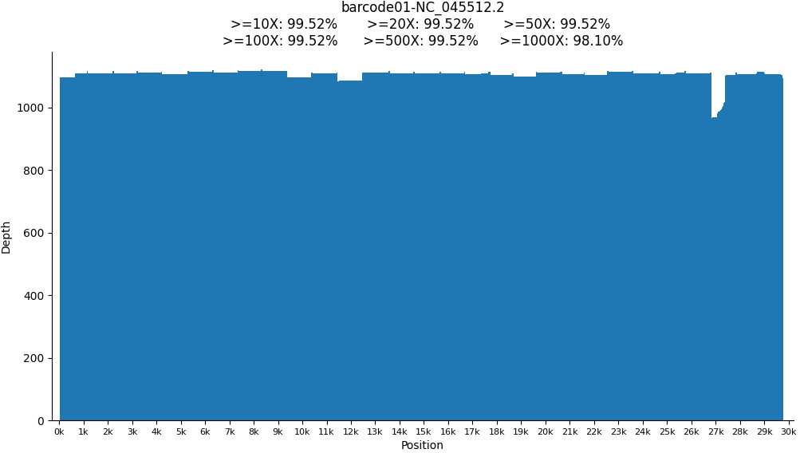
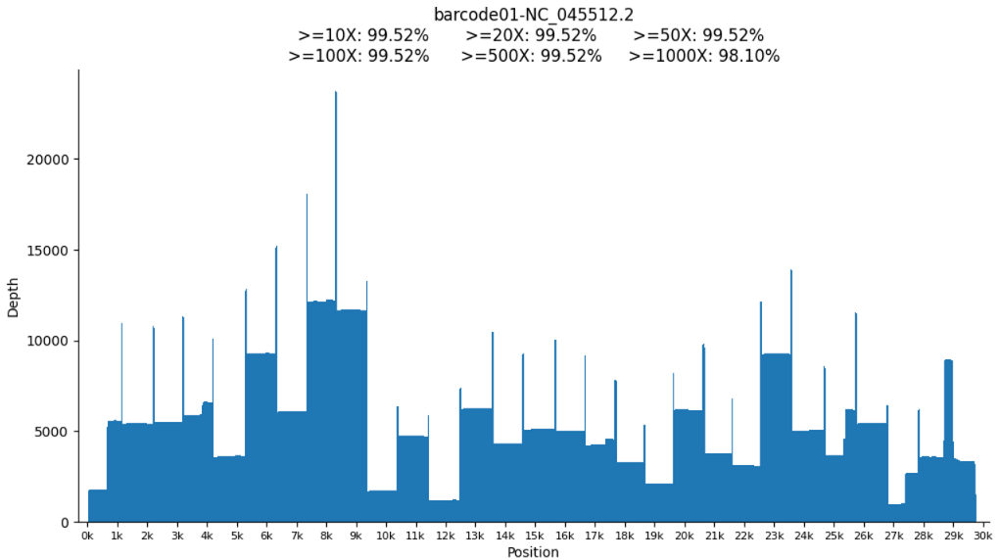

# artic-like使用说明

artic-like是用于分析类似于叠瓦式引物扩增的病毒序列以获得一致性序列的一套分析流程，最早开发用于分析新冠病毒的全基因组序列，经过修改之后可以分析新冠病毒、猴痘病毒或者自定义添加的病毒序列，支持纳米孔测序数据、二代PE或者SE数据。输出结果包含一些简单的数据统计信息、参考基因组覆盖深度统计图、变异列表信息和一致性序列，以及包含这些信息的一个excel表格报告。流程基于nextflow本地搭建，使用conda来控制软件环境，因此在使用之前需要首先安装[nextflow](https://www.nextflow.io/docs/latest/getstarted.html)和[conda](https://www.anaconda.com/download)。

## 安装

假设已经安装好conda和nextflow，且已将nextflow 和 conda加入到环境变量

### 目录结构

将项目复制到自定义目录下，目录结构如下图：



```shell
nextflow run main.nf --help # 输出帮助信息，如下图
```



### 安装conda环境

```shell
cd artic-like/envs
conda env create -f artic-like.yaml
conda env create -f artic-like-pangolin.yaml
conda env create -f freebayes.yaml
conda env create -f clair3.yaml
```

## 使用帮助

使用`nextflow run main.nf --help`可以获得帮助信息，见上图

### 用例

1. 1200bp长片段扩增子、新冠、连接法测序、引物文件：/home/a/Desktop/primer.bed，在项目目录(artic-like)下执行以下命令：

   ```shell
   nextflow run main.nf --long_reads /the/path/to/long_reads --primer_bed /home/a/Desktop/primer.bed 
   ```

   会在**项目目录**下输出`test001`文件夹，目录内容根据输入实际情况而定，见[`--analysis_name`](#--analysis_name)

2. 400bp短片段扩增子，新冠、连接法测序，未知引物，6个barcode 纳米孔测序样本，在项目目录(artic-like)下执行以下命令：

   ```shell
   nextflow run main.nf --long_reads /the/path/to/long_reads/fastq_pass --directory /home/a/big/ycq/analysis_out/ --analysis_name test_multi_ont --min_read_len 100 --max_read_len 600 
   ```

   会在`/home/a/big/ycq/analysis_out/`下新建`test_multi_ont`目录，并在内创建barcode01-barcode06共计6个目录来保存对应样本的分析结果

3.  NGS 双端数据，猴痘，无引物文件，在项目目录(artic-like)下执行以下命令：

   ```shell
   nextflow run main.nf --reads1 /the/path/to/reads1.fastq.gz --reads2 /the/path/to/read2.fastq.gz --virus mpx --directory /home/test/output --analysis_name first_mpx 
   ```

   会在`/home/test/output`下输出`first_mpx/first_mpx`文件夹，该样本的结果将会保存在该文件夹内

4.  自添加蓝耳病病毒prrs [(如何新增可分析病毒？)](#--virus)，8个barcode 纳米孔测序样本，无引物文件，在项目目录(artic-like)下执行以下命令：

   ```shell
   nextflow run main.nf --long_reads /the/path/to/long_reads --virus prrs --directory /home/test/prrs_results --analysis_name pprs
   ```

   会在`/home/test/prrs_results`下新建`pprs`目录，并在内创建barcode01-barcode08共计8个目录来保存对应样本的分析结果

### 参数

**所有的文件输入参数都需要执行绝对路径**

#### --long_reads

待分析数据为ONT数据，有三种输入形式

1. 单个fastq或者fastq.gz文件，此时样本数为1
2. 一个包含多个fastq数据的文件夹，类似于纳米孔下机数据拆分后的barcode文件夹，此时样本数为1
3. 一个包含多个子文件夹的文件夹，每个子文件夹里又包含多个fastq数据，每个子文件夹中对应一个样本，此时样本数由子文件夹数量而定。类似于纳米孔测序下机数据中的fastq_pass文件夹。这些样本会并行的进行分析。

#### --reads1

NGS数据的reads1。`--reads1`和`--long_reads`参数二者有且只能有一个设定，同时设定或者均不设置会报错提醒。如果指定`--long_reads`说明分析数据为纳米孔测序数据，反之如果指定了`--reads1`说明待分析数据为NGS双端或者单端数据（根据`--reads2`参数确定）。

#### --reads2

NGS 双端数据reads2。同时指定`--reads1`和`--reads2`说明输入为NGS双端数据

#### --min_read_len

纳米孔测序数据序列最短长度，默认300

#### --max_read_len

纳米孔测序数据序列最大长度，默认1900

#### --min_read_qual

纳米孔测序数据序列最小质量值，默认10

#### --trim_bases

对于病毒扩增子进行三代纳米孔测序时，常用的方法是连接法建库，这种建库方式会将一对引物的扩增子进行不打断的测序，该条测序read理论上会从头至尾的比对到参考基因组，该read首尾的大概20bp区域都是由引物结合，而不是扩增延伸得到的序列。在没有指定`--primer_bed`的时候，会在比对后的bam文件**而不是原始fastq文件**上将每一条alignment的前后`--trim_bases`个碱基给trim掉，以降低引物结合造成的影响。如果指定了`--primer_bed`，该参数无效。对于快速法建库测序，且不指定`--primer_bed`时，该参数有待商榷。对于NGS数据，该参数无效。默认20

#### --min_overlap

如果指定了[`--primer_bed`](#--primer_bed)参数，流程会根据提供的引物信息来使用`trim_align.py`进行trim引物，该脚本会找到bam文件中每条alignment最可能得扩增引物对。如果trim引物之后，比对区域和该引物对的理论扩增区域overlap区域（实际上就是trim之后的比对长度）小于该参数，则该alignment会被丢弃。

如果没有指定`--primer_bed`参数，则trim之后的比对长度小于该参数的alignment会被丢弃。默认300

#### --files_per_bar

如果输入的`--long_reads`为第三种情况，即包含多个子文件夹的目录，如果某个子文件夹里的fastq文件数小于该参数，则该样本不分析。在分析多个样本时可以应对错误拆分的情况。fastq_pass下的unclassified文件夹不会被分析。默认2

#### --model

对于纳米孔测序数据使用[clair3](https://github.com/HKU-BAL/Clair3)来进行call变异，该参数指定call变异时使用的模型，可选的模型为项目文件夹下`clair3_model`里的文件夹名称。如果需要使用其他model，可以从[clair3](https://github.com/HKU-BAL/Clair3)或者[rerio](https://github.com/nanoporetech/rerio)下载并保存到`artic-like/clair3_model`里。目前可选有以下：

		* r1041_e82_400bps_fast_g632
		* r1041_e82_400bps_hac_g632
		* r1041_e82_400bps_hac_v430
		* r1041_e82_400bps_sup_g615
		* r1041_e82_400bps_sup_v430
		* r941_prom_sup_g5014

默认 **r941_prom_sup_g501**

#### --map_cpu

比对用的线程数，默认4

#### --min_mapq

最小比对质量值，对于病毒扩增子而言，理论上应该绝大部分序列都应该完全比对到参考基因组上，所以该参数默认为60

#### --min_dp

获取一致性序列或者call变异时，最低的深度要求，如果深度低于该值，则一致性序列中该区域设为N

#### --min_snv_freq

在获取一致性序列时，有些位点明显是“杂合”位点，猜测可能得原因有两种：1. 测序错误；2. 实际情况中样本内有两种或者以上毒株，尤其时HIV病毒，一些常见位置经常是简并碱基。但是获取的一致性序列只有一条，所以如果次等位基因频率大于该值则认为该位置是一个有效突变，否则认定为野生型

#### --primer_bed

包含引物信息的bed文件，流程根据该文件进行引物trim以尽可能的消除引物影响。引物文件无需表头，包含有如下4列信息：

* contig名称：必须与参考基因组中的序列名称相同
* start位置：引物启示位置，based-0
* end位置：引物结束位置
* **引物名称：引物名称格式应该为`{PRIMER_NAME}_LEFT`或者`{PRIMER_NAME}_RIGHT`，其中`PRIMER_NAME`用于区分碱基对，`LEFT`或者`RIGHT`用于区分上游或者下游引物**

#### --virus

**样本是何种病毒，可选的值为`artic-like/genomes`下的文件名，流程会从`artic-like/genomes/virus`目录下查找`sequences.fa`作为参考序列。因此可以手动向`artic-like/genomes`下添加目录以及参考序列，来分析自定义的病毒或者序列**。默认为sars-cov-2

#### --conda_path

该参数指定conda环境的路径，可以在命令行中指定，建议直接修改`nextflow.config`中`params`的`conda_path`参数。流程基于conda来进行环境管理，需要用到提前安装的[conda环境](#安装指定conda环境)。

#### --directory

将所有结果都保存到该参数指定的目录下

#### --analysis_name

在`--directory`中创建一个名为`--analysis_name`的目录用于保存各个样本的结果。当输入为NGS数据或者纳米孔测序数据`--long_reads`的情况1或者2时，会在`--directory/--analysis_name`下再次创建一个名为`--analysis_name`的文件夹用于保存该单个样本的结果。如果输入为纳米孔测序数据`--long_reads`的情况3时，会在`--directory/--analysis_name`下创建以`--long_reads`下满足条件（`--files_per_bar`和非`unclassified`目录）的所有文件夹的名称为名的目录，以保存对应样本的结果。

例：如果输入为包含01-12个barcode文件夹的fastq目录时，会在`--directory/--analysis_name`下新建barcode01-barcode12总共12个目录，用于保存barcode01-barcode12总共12个样本的结果

#### --pango_virus

以逗号分隔的virus名称，如果`--virus`在该列表中，则会使用pangolin对该样本进行分型鉴定

#### --help

打印帮助信息并退出

## 结果说明

### 外层结构

以[用例](#用例)2为例，流程会在`/home/a/big/ycq/analysis_out/`下新建`test_multi_ont`目录，其内结构如下：



其中barcode01 - barcode06用于保存对应barcode的输出结果，`test_multi_ont-trace.txt`为分析过程中的trace文件，用于追踪流程运行过程中的各种信息，该文件命名格式为`{analysis_name}-trace.txt`，保存在`--directory/--analysis_name/`下，总计12列，分别为：`task_id`, `hash`, `process`, `tag`, `name`, `status`, `cpus`, `time`, `start`, `complete`, `duration`, `workdir`, `script`。格列含义见[nextflow trace fields](https://www.nextflow.io/docs/latest/tracing.html#trace-fields)

### 内层结构

以[用例](#用例)2的barcode01为例，结构目录如下：



比较重要的几个结果文件如下：

1. `01.clean_data/barcode01.clean.fastq.gz` 过滤之后的fastq序列

2. `01.clean_data/barcode01.raw.fastq.gz` 纳米孔测序数据原始数据合并之后的文件

3. `02.aligns/barcode01.primer_trimmed.bam` 根据或者不根据`--primer_bed`trim之后的bam文件，所有的后续分析都是基于该bam

4. `03.stats/*png` raw、clean、mapped fastq数据作图，readLength VS readQuality

5. `03.stats/barcode01.summary.txt` raw、clean、mapped数据的基本统计，如下图：

   

6. `04.depth/barcode01.low_cover.bed` 测序深度低于`--min_dp`区域，一致性序列中这些区域为N

7. `04.depth/*coverage.png` 参考基因组上的覆盖情况，`*modified.coverage.png`为把深度downsampling 到1000的统计图表，`*raw.coverage.png`为原始深度的统计图表。可以直接反应实验的好坏程度和各个区域引物的扩增效率。分别如图：

   ##### 

8. `04.depth/barcode01.per-pos.depth` 参考基因组上各个位置上的测序深度，上放图片根据该文件所做

9. `05.variants/barcode01.report.vcf` 最终的call变异文件

10. `06.consensus/barcode01.consensus.fasta` 最终的一致性序列文件，序列名称格式为`{sample_name}-{contig_name}`

11. `07.pangolin/barcode01.pangolin.report` 如果使用pangolin进行分型的话，结果会输出到该文件中，目前进针对`--virus sars-cov-2`有效，否则为空文件

12. `08.report/barcode01.report.xlsx` 输出的简单的excel报告

## 联系

yinchaoqun@bio-chain.com
