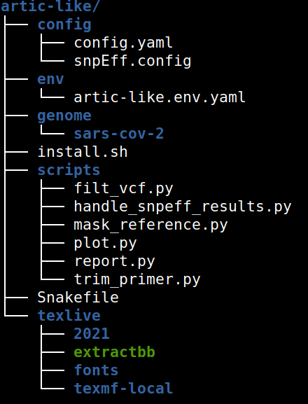
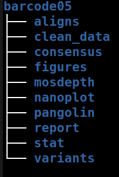

# 新冠病毒全基因组分析流程说明书

​		这个流程根据artic流程修改过来，所以叫做artic-like，核心部分跟artic基本上一样，artic分析的时候必需要指定扩增的引物，然后根据引物位置对bam文件进行trim，artic-like保留了这项设置，又增加了当不确定引物的时候的分析方法：未知引物时，可以自定义从read两端进行一定长度的trim，然后挑选map质量值大于指定值的alignment作为最终比对。***是否指定primer_bed，输出的变异位点和结果会有差异。软件方面使用medaka、longshot组合和仅使用medaka，输出结果也会有细微差异。***得到一致性序列后进行覆盖度作图和变异注释，最后出一个报告。

## 安装

​		使用之前**必需安装conda**，整个流程依赖于conda进行软件安装和管理

### 方法1：

```shell
wget https://github.com/aadali/artic-like/archive/refs/heads/master.zip
unzip master.zip
mv artic-like-master artic-like
cd artic-like
conda env create -f artic-like.env.yaml	# 创建artic-like环境
sudo apt install texlive-binaries	# 安装texlive
```

### 方法2：

```shell
git clone https://github.com/aadali/artic-like.git
cd artic-like
conda env create -f env/artic-like.env.yaml	# 创建artic-like环境
sudo apt install texlive-binaries	# 安装texlive
```

#### **注**：*如果使用第一种方法安装，zip压缩包不要在windows或者U盘中进行解压，因为windows系统中解压出来的文件会丢失软texlive文件中一些可执行文件的软连接信息，导致在Ubutu下不能正常使用。可以通过windows或者u盘拷贝zip压缩文件到Ubuntu系统中，unzip后进行操作。*

​		这个过程conda会新建一个名为`artic-like`的新环境，**安装完成后，重启一下终端**，`conda activate artic-like`即可使用

## 使用

​		使用之前首先要激活`artic-like`环境，然后用[`snakemake`](https://snakemake.readthedocs.io/en/stable/)来控制分析流程。该流程在Ubuntu20.04上以及win10的Ubuntu子系统上测试过。

#### 1.  一致性序列

```shell
snakemake consensus --cores all --config input_fastq=the/path/to/fastq	# --cores all指定所有线程进行分析，也可以写作 --cores 12 或者 --cores 8，指定12个或者8个线程分析。cores必需指定
```

即可进行分析，在当前文件夹下输出`test001`文件夹，在`test001/consensus`中即可找到一致性序列，其中`test001`和输出文件夹所在目录可以在`config/config.yaml`中进行指定，也可以在命令行中进行修改，见[文件说明](#文件说明)。

#### 2. 注释

注释为可选步骤

```shell
snakemake annotate --cores all --config input_fastq=the/path/to/fastq 
```

对call到的变异进行注释（如果有注释文件的话，例如sars-cov-2，如果没有注释文件，则可以跳过这一步，直接进行报告生成）

### 3. 报告

```shell
snakemake report --cores all --config input_fastq=the/path/to/fastq 
```

这一步可以在`test001/reprot`中输出`test001.report.pdf`报告。


## 文件说明

​		artic-like文件夹中包含文件如下：

 

### config

1. `config.yaml`为分析流程中的配置参数，参数如下：

   > * `input_fastq` **待分析的数据所在的路径，接受文件夹或者文件，以fastq/fq/fastq.gz/fq.gz结尾**
   > * `primer_bed` **如果有引物信息可以指定引物文件所在位置，如果没有忽略即可。primer_bed文件无需标题行，4列，以tab建分隔。第一列：染色体号；第二列：引物起始位置，base-0；第三列：引物终止位置，base-0；第三列：引物名称，以`_LEFT`或者`_RIGHT`结尾，用于表示上游和下游引物，每对引物的前缀必需一致。**
   > * `trim_bases` 引物信息未知时，read两端trim掉的碱基数，指定`primer_bed`后该参数无效
   > * `min_read_len` read长度小于该值时，会去掉该read
   > * `max_read_len` read长度大于该值，会去掉该read
   > * `min_read_qual` read质量值小于该值，会去掉该read
   > * `min_mapq` map质量值小于该值时，alignment会被去掉
   > * `map_thread` 比对时用的threads数
   > * `sample_name` **样本名称，输出文件夹的名称，以及各种输出文件的前缀**
   > * `what_sample` **是哪种类型的样本，目前只能是`sars-cov-2`，必需是`genome`文件夹下的一个，后续可以通过在`genome`文件夹下增加新的病毒类型比如`hbv`等，用于后续分析样本类型扩展。**
   > * `model` medaka用到的model参数
   > * `min_dp` 最小深度，小于这个深度时，一致性序列该位置设定为N
   > * `min_qual` 变异位点质量值小于该值会被过滤掉，生成的一致性序列中该位点为N
   > * `het_site` 针对杂合位点，怎样处理。如果het_site为"more"，则一致性序列中该位点为深度较高的allele。如果het_site为“N”，则所有杂合位点都设置为N
   > * `frameshifts` 是否保留造成移码突变的variant。1保留，0设置为N。默认1
   > * `longshot` 是否使用longshot来进行call variants，先前版本artic分析流程默认使用longshot，最新的artic v1.3.0版本仅使用medaka进行call变异。使用longshot和medaka得到的结果会有差异。1使用longshot，0不使用longshot，而使用medaka

2. `snpEff.config` snpEFF软件的配置配置文件

### env

artic-lie.env.yaml：创建`artic-like`的env.yaml文件，`conda env create -f artic-lie.env.yaml`会创建artic-like环境

### genome

snpEff软件`-dataDir`的参数。文件夹里包含了以可以分析的样本类型命名的文件夹。如`sars-cov-2`。每个文件夹里包含的文件如下：

 

> * `genes.gff` 为变异注释文件
> * `sequences.fa` 为参考基因组文件
> * `sequences.fa.fai` 为分析时自动生成的索引文件，可以忽略
> * `snpEffectPredictor.bin` 为使用snpEff进行注释之前要构建的一个文件，注释需要，需要手动生成

如果后续增加了`other_virus`或者其他病毒的信息，则需要在该文件夹下新建一个以`other_virus`命名的文件夹，并在`other_virus`下保存`sequences.fa`基因组文件和可选的（`genes.gff`、`snpEffectPredictor.bin`）文件，还需要修改在`config/snpEff.config`中增加`some_virus`的信息（可参考[这里](http://pcingola.github.io/SnpEff/se_buildingdb/)）

### scripts

分析过程中使用到的一些脚本

1. `filter_vcf.py` 根据深度、质量值等过滤longshot输出的vcf文件
2. `handle_snpeff_results.py` 从注释vcf文件中提取信息，用于报告展示
3. `mask_reference.py`  将参考基因组上低质量的位点标记为N
4. `plot.py` 覆盖深度作图，当某一位点深度大于1200时将其修改为1200，所以图中显示最大深度即为1200
5. `report.py` 生成pdf报告的tex源文件
6. `trim_primer.py` 如果指定引物的话，会使用该脚本从比对后的bam文件中修改比对record，在alignment trim掉引物区域的比对，使其比对位置从前引物末端 开始 到 后引物起始位置 结束

### Snakefile

比对的流程及需要执行的shell脚本都包含在该文件中，Snakemake命令默认会在当前目录下寻找`Snakefile`或`snakefile`。或者通过命令行指定snakefile：`--snakefile path/to/specified/snakefile`

### texlive

打包的一个texlive软件，用于编译tex文件输出pdf报告

## 输出文件说明

默认情况下会在当前文件夹下输出`test001`，通过`--config sample_name=barcode03`可以将输出文件夹指定为`barcode03`，其目录结构如下： 

  

1. `aligns`各种比对文件有raw.bam、sorted.bam和primer_trimmed.bam\
   * `raw.bam` 最原始的bam文件，保留了所有的比对
   * `sorted.bam` 去除了一些低质量比对，并排序
   * `primer_trimmed.bam` 如果有引物信息（config.yaml中指定了primer_bed参数），原始数据进行fastp过滤时，不进行read的两端的trim，直接进行比对，之后按照引物位置进行alignment Trim，得到primer_trimmed.bam。如果没有引物信息，原始数据进行fastp过滤时，首先对read两端进行一定长度的trim，然后再将得到的read进行比对，之后挑取一些mapQ大于指定值的alignment，得到primer_trimmed.bam
2. `clean_data` 根据读长和质量值过滤后输出的clean.data.fastq.gz
3. `consensus` 输出一致性序列
4. `fuigures` 覆盖深度统计图
5. `mosdepth` [mosdepth](https://github.com/brentp/mosdepth)软件可以快速的进行深度统计，输出每个位点的覆盖深度，只用到该目录下`per-base.bed.gz`结尾的文件
6. `nanoplot` NanoPlot输出的一些统计信息和图片
7. `pangolin` 新冠样本会使用pangolin进行一个分型分析，结果保存在这里，如果没有`snakemake annotate` 则不会生成该目录
8. `report` 输出的报告
9. `stat` 进行的一个简单统计，包括原始数据量和read数以及比对到参考基因组（aligns目录下的primmer_trimmed.bam）上的数据量和read条数
10. `variants` 分析过程中产生的变异文件以及注释文件
    * `{SAMPLE}.fail.vcf.gz` 一些深度较低或者QUAL较低，或者一些杂合位点（het_sites设置为"more"）或者一些移码突变的位点（frameshifts设置为0）,这些位置会被设置为N
    * `{SAMPLE}.pass.vcf.gz` bcftools consensus会使用这个文件输出consensus序列，apply alt, ignore genotype
    * `{SAMPLE}.report.vcf`   `{SAMPLE}.report.snpEff.annotate.vcf`报告会输出这个文件中的变异位点
    * `{SAMPLE}.report.snpEff.annotate.txt` 报告中输出的变异位点列表，tab键分隔
    * `{SAMPLE}.medaka.vcf` 从`{SAMPLE}.medaka.gvcf.gz`中过滤得到的变异位点，排除这些位点：ALT="." || QUAL < {MIN_QUAL}

## snakemake简单说明和使用示例

snakemake是一个用来进行生信分析流程搭建和管理的软件，可以和python无缝衔接。snakemake默认情况下会在当前目录寻找是否有`snakefile`或者`Snakefile`从而解析其中的分析流程。可以通过命令行指定`config.yaml`文件或者在`Snakefile`中指定`config.yaml`文件，从而向分析流程中传递参数，以artic-like为例，首先激活artic-like环境 conda activate artic-like

1. 首先进入artic-like目录，并手动修改了`config/config.yaml`文件中的`input_fastq`，同时将`sample_name`指定为`hello`，执行以下命令即可完成分析 

   ```shell
   snakemake consensus --cores 14 # cores 随意指定
   snakemake annotate --cores 6	# 可选步骤
   snakemake report --cores 1 # 输出报告
   ```

   或者执行以下命令：

   ```shell
   snakemake --cores 14
   # 该命令默认一次性执行consensus、annotate、report三个命令。针对注释信息的样本，如果样本缺少注释信息，则在执行annotate命令时可能会报错，这时需要分开执行consensus、annotate、report
   ```

   

   会在当前目录下输出名为`hello`的文件夹，包含各种分析结果

2. 通过命令行修改参数。如果不想修改`config/config.yaml`文件，也可以在命令行中修改config参数，命令如下：

   ```shell
   snakemake consensus --cores 12 --config input_fasdq=the/path/to/fastq sample_name=today min_read_len=500	# 相当于修改了config.yaml文件中的inpuf_fastq、sample_name和min_read_len 的值
   
   snakemake annotate --cores 3 --config input_fasdq=the/path/to/fastq sample_name=today min_read_len=500	
   
   snakemake report --cores 1 --config input_fasdq=the/path/to/fastq sample_name=today min_read_len=500	
   ```

3. 指定输出目录，或者在任何目录下进行分析

   ```shell
   snakemake consensus --cores 12 --directory ~/Desktop --config sample_name=tomorrow input_fastq=~/Desktop/test.fastq.gz # 会在~/Desktop目录下输出结果目录 tomorrow
   ```

   在任意目录下进行分析时需要指定Snakefile，snakemake会根据Snakefile所在路径确定其他配置文件或者脚本的路径：

   ```shell
   cd ~/Document/test	# 在~/Document/test执行分析流程
   snakemake consensus --cores 12 --snakefile the/path/to/artic-like/Snakefile # 指定Snakefile路径即可分析，参数按照artic-like/config/config.yaml中进行
   ```

   ## TODO List

   1. ~~获得一致性序列时，目前的方案是将杂合的位点、indel不是3的倍数（移码突变）的位置标记为N，后续考虑增加参数，对于杂合位点突变频率大于特定值的情况下才将其标记为N。~~
   2. ~~报告中展示的变异位点时排除了杂合位点、以及移码突变和深度太低之外的变异位点（这些位点在variants文件夹中称为fail.variants），后期考虑将所有变异位点都展示出来~~
   3. 基因组覆盖图目前只能做一张，因为新冠就一条序列。如果以后增加分析样本类型，比如甲流这样的8段序列的时候，需要多做几张图，或者一张图分为几个faced展示
   4. 对于环形的病毒基因组组可能会有问题
   5. 只在乙肝上进行过根据引物位置进行trim，其他物种的病毒尚未尝试
   6. 增加其他病毒的注释信息，目前只能用于其他病毒获得一致性序列即只执行`snakemake consensus`和`snakemake report`，而没有注释信息`snakemake annotate`

   

