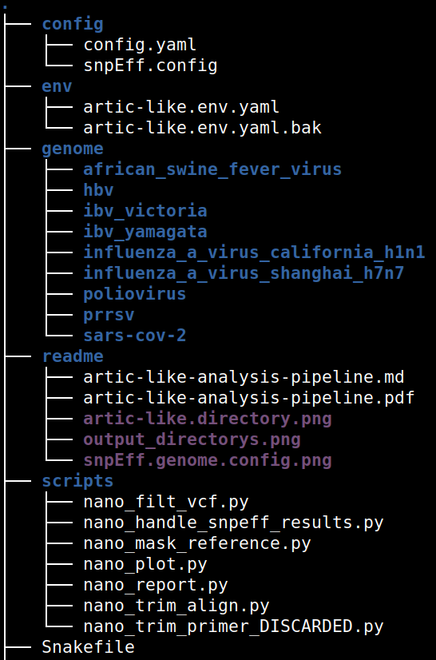
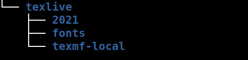
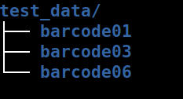
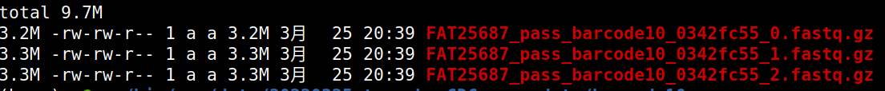
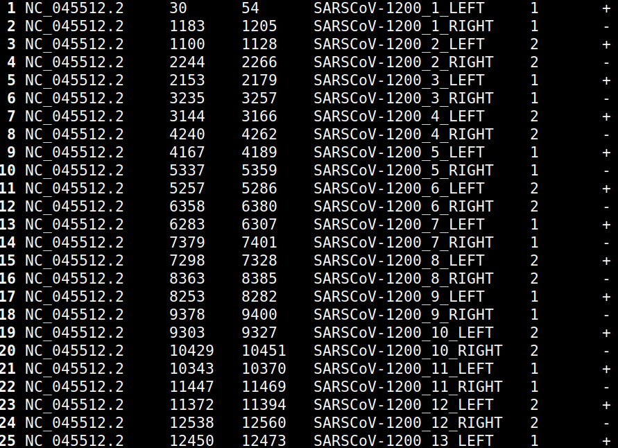
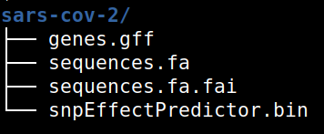
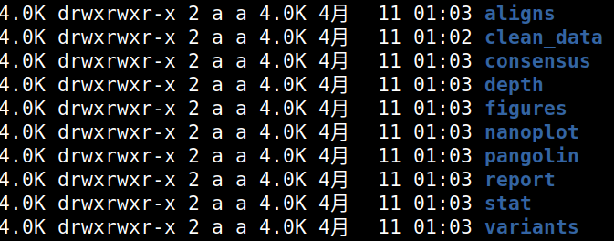

# 新冠病毒全基因组分析流程说明书

这个流程参考[artic](#https://artic.network)分析流程，适用于Nanopore平台新冠全基因组扩增子测序分析流程。除了可以和artic一样在已知引物文件时指定引物bed文件外，还可以在未知引物位置时，通过两端进行固定值的trim来尽可能的消除引物带来的影响。整个流程使用snakemake来进行控制，可以输出新冠基因组的深度覆盖图、一致性全基因组序列、pangolin分型、变异列表和包含上述信息的一个pdf报告。

## 安装

使用之前**必需安装conda**，整个流程依赖于conda进行软件安装和管理

### 方法1：

```shell
wget https://github.com/aadali/artic-like/archive/refs/heads/master.zip
unzip master.zip
mv artic-like-master artic-like
cd artic-like
conda env create -f env/artic-like.env.yaml	# 创建artic-like环境
conda env create -f env/artic-like-igvtools.yaml
conda env create -f env/artic-like-pangolin.yaml
sudo apt install texlive-binaries	# 安装texlive
```

### 方法2：

```shell
git clone https://github.com/aadali/artic-like.git
cd artic-like
conda env create -f env/artic-like.env.yaml	# 创建artic-like环境
conda env create -f env/artic-like-igvtools.yaml
conda env create -f env/artic-like-pangolin.yaml
sudo apt install texlive-binaries	# 安装texlive
```

#### **注**：*如果使用第一种方法安装，zip压缩包不要在windows或者U盘中进行解压，因为windows系统中解压出来的文件会丢失软texlive文件中一些可执行文件的软连接信息，导致在Ubutu下不能正常使用。可以通过windows或者u盘拷贝zip压缩文件到Ubuntu系统中，unzip后进行操作。*

这个过程conda会新建名为`artic-like`、`artic-like-igvtools`、`artic-like-pangolin`的新环境，**安装完成后，重启一下终端**，`conda activate artic-like`即可使用

## 使用

使用之前首先要激活`artic-like`环境，然后用 [snakemake](https://snakemake.readthedocs.io/en/stable) 来控制分析流程。该流程在Ubuntu20.04上以及win10的Ubuntu子系统上测试过。

#### 1.  一致性序列

```shell
snakemake consensus --cores all --config input_fastq=the/path/to/fastq	# --cores all指定所有线程进行分析，也可以写作 --cores 12 或者 --cores 8，指定12个或者8个线程分析。cores必需指定
```

即可进行分析，在当前文件夹下输出`test001`文件夹，并在`test001`下输出另外一个包含所有结果的`test001`文件夹，在`test001/test001/consensus`中即可找到一致性序列，其中`test001`和输出文件夹所在目录可以在`config/config.yaml`中通过修改`analysis_name`来进行指定，也可以在命令行中进行修改，见[文件说明](#文件说明)。

#### 2. 注释


```shell
snakemake annotate --cores all --config input_fastq=the/path/to/fastq 
```


### 3. 报告

```shell
snakemake report --cores all --config input_fastq=the/path/to/fastq 
```

这一步可以在`test001/test001/reprot`中输出`test001.report.pdf`报告。


## 文件说明

artic-like文件夹中包含文件如下：

  


### config

1. `config.yaml`为分析流程中的配置参数，参数如下：

   * `input_fastq` **待分析的数据所在的绝对路径，接受文件夹或者文件。如果是文件夹，可以分为两种情况，1). 文件夹中可以包含若干个包含fastq文件的子文件夹，类似与nanopore测序平台中输出的fastq_pass文件夹中包含多个barcode文件夹，文件结构如下：**

     
   
     此时会在输出`${analysis_name}`文件夹下边分别输出以input_fastq下子文件夹名称命名的文件夹，每个样本的分析结果输出在对应的文件夹下。
      
     **2). 文件夹中知己包含fastq序列，文件结构如下：**
   
     
   
   * `primer_bed` **如果有引物信息可以指定引物文件所在位置，如果没有忽略即可。primer_bed文件无需标题行，4列，以tab建分隔。第一列：染色体号；第二列：引物起始位置，base-0；第三列：引物终止位置，base-0；第四列：引物名称，以`_LEFT`或者`_RIGHT`结尾，用于表示上游和下游引物，每对引物的前缀必需一致,用于表示为一对引物;第五列为引物池名称，是1或者2；第六列指定正链（+）或反链（-）。最后两列在该流程中可有可无，如果要用于artic流程，则需要加上第5列。引物信息格式如下：**
   
     
   
     jclife扩增的引物应使用 `${artic-like-directory}/genome/sars-cov-2/jc-1200-primers.bed`
  * `trim_bases` 引物信息未知时，bam文件中alignment两端需要trim掉的碱基数(**不是从read两端trim**)，指定`primer_bed`后该参数无效，默认25
  * `min_read_len` read长度小于该值时，会去掉该read
  * `max_read_len` read长度大于该值，会去掉该read
  * `min_read_qual` read质量值小于该值，会去掉该read
  * `min_mapq` map质量值小于该值时，alignment会被去掉
  * `analysis_name` **样本名称，输出文件夹的名称，以及各种输出文件的前缀**
  * `what_sample` **是哪种类型的样本，必需是`genome`文件夹下的一个，后续可以通过在`genome`文件夹下增加新的病毒类型比如`hbv`等，用于后续分析样本类型扩展。**
  * `model` medaka用到的model参数
  * `min_dp` 最小深度，小于这个深度时，一致性序列该位置设定为N
  * `min_qual` 变异位点质量值小于该值会被过滤掉，生成的一致性序列中该位点为N
  * `het_site` 针对杂合位点，怎样处理。如果het_site为"more"，则一致性序列中该位点为深度较高的allele。如果het_site为“N”，则所有杂合位点都设置为N，**暂时未使用**
  * `min_overlap` bam文件中trim掉引物之后或者trim掉固定长度之后，最小的比对长度，小于该值则这条alignment会被去掉。建议RAD或者RBK试剂盒时，设为400; LSK试剂盒1200扩增设置为800，400扩增设置为200
  * `files_per_bar` 如果input_fastq为包含多个barcode的 fastq_pass文件夹，则规定每个barcode文件夹中最少有`files_per_bar`个fastq文件，如果少于该值，则不分析这个样本。用于应对barcode拆分错误，unclassfied文件夹不分析

2. `snpEff.config` snpEFF软件的配置配置文件

### env

artic-lie.env.yaml：创建`artic-like`的env.yaml文件，`conda env create -f artic-lie.env.yaml`会创建artic-like环境

### genome

snpEff软件`-dataDir`的参数。文件夹里包含了以可以分析的样本类型命名的文件夹。如`sars-cov-2`。每个文件夹里包含的文件如下：

 

> * `genes.gff` 为变异注释文件
> * `sequences.fa` 为参考基因组文件
> * `sequences.fa.fai` 为分析时自动生成的索引文件，可以忽略
> * `snpEffectPredictor.bin` 为使用snpEff进行注释之前要构建的一个文件，注释需要，需要手动生成

如果后续增加了`other_virus`或者其他病毒的信息，则需要在该文件夹下新建一个以`other_virus`命名的文件夹，并在`other_virus`下保存`sequences.fa`基因组文件和可选的（`genes.gff`、`snpEffectPredictor.bin`）文件，还需要修改在`config/snpEff.config`中增加`some_virus`的信息（可参考[这里](http://pcingola.github.io/SnpEff/se_buildingdb/)）

### scripts

分析过程中使用到的一些脚本

1. `nano_filter_vcf.py` 根据深度、质量值等过滤longshot输出的vcf文件
2. `nano_handle_snpeff_results.py` 从注释vcf文件中提取信息，用于报告展示
3. `nano_mask_reference.py`  将参考基因组上低质量的位点标记为N
4. `nano_plot.py` 覆盖深度作图，当某一位点深度大于1200时将其修改为1200，所以图中显示最大深度即为1200
5. `nano_report.py` 生成pdf报告的tex源文件
6. `nano_trim_align.py` 如果指定引物的话，会使用该脚本从比对后的bam文件中修改比对record，在alignment trim掉引物区域的比对，使其比对位置从前引物末端 开始 到 后引物起始位置 结束
7. `nano_trim_primer_DISCARDED.py` 已废弃

### Snakefile

比对的流程及需要执行的shell脚本都包含在该文件中，Snakemake命令默认会在当前目录下寻找`Snakefile`或`snakefile`。或者通过命令行指定snakefile：`--snakefile path/to/specified/snakefile`

### texlive

打包的一个texlive软件，用于编译tex文件输出pdf报告

## 输出文件说明

默认情况下会在当前文件夹下输出`test001`，通过`--config analysis_name=barcode03`可以将输出文件夹指定为`barcode03/barcode03`，其目录结构如下： 

  

1. `aligns`各种比对文件有raw.bam、sorted.bam和primer_trimmed.bam\
   * `raw.bam` 最原始的bam文件，保留了所有的比对
   * `sorted.bam` 去除了一些低质量比对，并排序
   * `primer_trimmed.bam` 如果有引物信息（config.yaml中指定了primer_bed参数），原始数据进行fastp过滤时，不进行read的两端的trim，直接进行比对，之后按照引物位置进行alignment Trim，得到primer_trimmed.bam。如果没有引物信息，原始数据进行fastp过滤时，首先根据长度进行过滤，然后再将得到的read进行比对，再从alignment两端进行一定碱基数量的trim，之后挑取一些mapQ大于指定值的alignment，得到primer_trimmed.bam
2. `clean_data` 根据读长和质量值过滤后输出的clean.data.fastq.gz
3. `consensus` 输出一致性序列
4. `fuigures` 覆盖深度统计图
5. `depth` 输出每个位点的覆盖深度，per-base.depth为每个点的覆盖深度，low_coverage.bed时从per-base.depth中挑出的深度低于`{min_dp}`的位置
6. `nanoplot` NanoPlot输出的一些统计信息和图片
7. `pangolin` 新冠样本会使用pangolin进行一个分型分析，结果保存在这里，如果没有`snakemake annotate` 则不会生成该目录
8. `report` 输出的报告
9. `stat` 进行的一个简单统计，包括原始数据量和read数以及比对到参考基因组（aligns目录下的primmer_trimmed.bam）上的数据量和read条数
10. `variants` 分析过程中产生的变异文件以及注释文件
    * `{SAMPLE}.fail.vcf.gz` 一些深度较低或者QUAL较低，或者一些杂合位点（het_sites设置为"more"）或者一些移码突变的位点（frameshifts设置为0）,这些位置会被设置为N
    * `{SAMPLE}.pass.vcf.gz` bcftools consensus会使用这个文件输出consensus序列，apply alt, ignore genotype
    * `{SAMPLE}.longshot.ann.vcf ` longshot注释得到每个等位基因的深度
    * `{SAMPLE}.report.vcf`   `{SAMPLE}.report.snpEff.annotate.vcf`报告会输出这个文件中的变异位点
    * `{SAMPLE}.report.snpEff.annotate.txt` 报告中输出的变异位点列表，tab键分隔
    * `{SAMPLE}.medaka.vcf` 从`{SAMPLE}.medaka.gvcf.gz`中过滤得到的变异位点，排除这些位点：ALT="." || QUAL < {MIN_QUAL}

## 针对该流程的snakemake简单说明和使用示例

snakemake是一个用来进行生信分析流程搭建和管理的软件，可以和python无缝衔接。snakemake默认情况下会在当前目录寻找是否有`snakefile`或者`Snakefile`从而解析其中的分析流程。可以通过命令行指定`config.yaml`文件或者在`Snakefile`中指定`config.yaml`文件，从而向分析流程中传递参数，以artic-like为例，首先激活artic-like环境 conda activate artic-like

**snakemake 使用时必需指定--cores 参数**

1. 在artic-like目录下进行分析（**常用**）。执行以下命令即可完成分析 

   ```shell
   snakemake consensus --cores all --config input_fastq=/the/path/to/input_fastq analysis_name=today min_read_len=800 max_read_len=1500 primer_bed=/the/path/to/primer.bed --directory ~/Desktop 
   
   snakemake annotate --cores all --config input_fastq=/the/path/to/input_fastq analysis_name=today min_read_len=800 max_read_len=1500 primer_bed=/the/path/to/primer.bed --directory ~/Desktop 
   
   snakemake all --cores all --config input_fastq=/the/path/to/input_fastq analysis_name=today min_read_len=800 max_read_len=1500 primer_bed=/the/path/to/primer.bed --directory ~/Desktop 
   
   # snakemake consensus 用于生成一致性序列，
   # input_fastq修改config/config.yaml中的input_fastq值， 
   # analysis_name指定分析名称，会在--directory参数，及在~/Desktop下创建名为{analysis_name}的目录。如果input_fastq中包含barcode01、barcode02、barcode03等多个样本，则会在~/Desktop/{analysis_name}下创建名为barcode01、barcode02、barcode03的文件夹，每个样本的输出结果输出到对应的文件夹中；若 input_fastq里仅包含fastq文件，则将结果输出到~/Desktop/{analysis_name}/{analysis_name}中
   # min_read_len 和 max_read_len 用于修改config/config.yaml 中的min_read_len 和 max_read_len参数
   # primer_bed 可选，已知引物信息则指定，未知则无需指定
   # config/config.yaml文件中的所有参数都可以通过在命令行中，跟在--config中 以 param_name=value 的形式进行修改
   # --directory 用于指定将结果输出到哪个目录中，如果不指定则为当前目录
   
   # snakemake annotate 用于对结果进行注释，分型等，所有参数与consensus 一致
   
   # snakemake report 用于生成pdf报告，所有参数与consensus 一致
   ```
2. 在任意目录下进行分析
   
   ```shell
   snakemake consensus --cores 16 --snakefile /the/path/to/artic-like/Snakefile  --config input_fastq=/the/path/to/input_fastq
   
   snakemake annotate --cores 16 --snakefile /the/path/to/artic-like/Snakefile  --config input_fastq=/the/path/to/input_fastq
   
   snakemake report --cores 16 --snakefile /the/path/to/artic-like/Snakefile  --config input_fastq=/the/path/to/input_fastq
   
   # 通过--snakefile 指定artic-like中的Snakefile即可在任意目录下使用artic-like流程
   ```
   
3. 一步执行
   ```shell
   snakemake all --cores 12 --config input_fastq=/the/path/to/input_fastq analysis_name=test2
   # 使用12个cores
   # snakemake all 会一步执行完consensus、annotate、report三步命令，将结果输出到当前文件夹下./test2/test2 中
   ```

   ## TODO List
    1. 杂合位点设置为深度较高的等位基因或者不考虑深度，默认为alt，或者强制为N   
   

